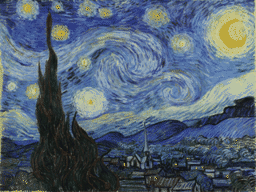

# illusionFrame

**A picture that mutates itself.** Point it at a painting (for now: a photo of one), mark what may
change, and a loop keeps feeding the image back through a generative model — the sky turns to
stained glass, then to jellyfish, then to embers — while the rest of the painting holds still.

| Diffusion (SD-Turbo, 16 iterations) | Procedural (no model, 24 iterations) |
|---|---|
|  |  |

*Van Gogh's The Starry Night (public domain), sky mask only: the village and cypress never change.
Rendered on a 2014 MacBook CPU (~45 s per diffusion step). Per-iteration stats for the diffusion run:
[demo_diffusion_metrics.jsonl](docs/images/demo_diffusion_metrics.jsonl) — clipped pixels stayed
under 1%, so the drift guard never had to step in.*

It is the first step toward projection mapping — festival-of-lights interventions, or projecting the
mutation back onto the real painting on your wall. v1.0 runs entirely on a picture; camera, projector
and Arduino control are designed in [ROADMAP.md](ROADMAP.md).

## How the loop works

```
reference ──► mix with last output (feedback) ──► colour-anchor to reference ──► mutate ──►
          ──► composite through the feathered mask ──► crossfade on screen ──► (feeds the next round)
```

- **Mutators**: *procedural* (flow-field warp, hue drift, edge glow, slow zoom — no model, real time)
  or *diffusion* (SD-Turbo img2img with prompts that morph from one to the next).
- **Masks** decide what may change: a clicked polygon, GrabCut (no model), or
  [boundaryBrush](../002-boundaryBrush) promptable segmentation (click the subject).
- **Stays stable**: feedback is capped, every iteration's colours are pulled back to the painting's
  (Reinhard transfer), and a blown-out result lowers feedback automatically.
- **Schedule**: prompts interpolate, strength "breathes" between restoring and mutating, seeds are
  held for a few iterations so structure stays coherent.
- **Wall preview** (`--view wall` or `v` in the live window): simulates projecting the mutation onto
  the painting with a linear-light reflectance model.

## Install

```bash
make install             # core: numpy + OpenCV — procedural mutator, live window, recording
make install-diffusion   # + torch 2.2.2, diffusers 0.35 (SD-Turbo); then: make fetch-models
```

## Use

```bash
# offline render (deterministic, virtual time) -> runs/<picture>/<timestamp>/{out.mp4,out.gif,keyframes/}
uv run illusionframe evolve examples/painting.jpg --session examples/session.toml
uv run illusionframe evolve examples/painting.jpg --session examples/session.toml --mutator diffusion
uv run illusionframe evolve examples/painting.jpg --session examples/session.toml --view wall

# live window: trackbars for strength and feedback; space = mutate now, n = next prompt,
# v = wall preview, s = snapshot, q = quit
uv run illusionframe run examples/painting.jpg --session examples/session.toml

# click a mask and save it into the session (polygon | grabcut | boundarybrush)
uv run illusionframe setup my_painting.jpg --mask grabcut --session my_session.toml
```

A session (see [examples/session.toml](examples/session.toml)) holds the prompts and schedule, the
loop settings, the mask and the mutator; it is copied into every run.

## Speed (2014 MacBook Pro, i7-4870HQ, CPU only)

| Mutator | Per mutation | Notes |
|---|---|---|
| procedural | ~0.1 s | also used as idle motion between diffusion results |
| diffusion, 384 px, TAESD | ~29 s | measured with other heavy jobs running |
| diffusion, 512 px, TAESD | ~48 s | full SD VAE instead: ~180 s |

Peak memory with diffusion ≈ 5.5 GB. Slow is fine for a painting — the display crossfades while
the next mutation is computed — but a live festival piece wants a GPU machine (same code).

## Limits

- The loop is built to *stay recognisably the painting*: colours are re-anchored every iteration and
  strength tops out around 0.65, so prompts steer texture and light more than subject matter (in the
  demo the "jellyfish" and "copper" prompts mostly show up as changes in the stars and the glow). Raise
  `strength_max` and `feedback`, or lower the anchoring, for wilder drift.

- Picture input only in v1.0 (no camera/projector yet); mapping onto a real painting is v1.1.
- SD-Turbo is under the Stability AI community licence: fine for personal and portfolio use; check it
  before a paid show. Weights are downloaded, never redistributed.

## Layout

`imageops.py` canvas ops · `engine/` schedule, loop state machine, mailbox, runners · `mutators/`
procedural, diffusion, mock · `masks/` polygon, GrabCut, boundaryBrush · `outputs/` recorder,
wall preview, windows · `session.py` · `cli.py`. Details in [CLAUDE.md](CLAUDE.md).

## License

MIT (code). The demo painting is public domain (Wikimedia Commons).
